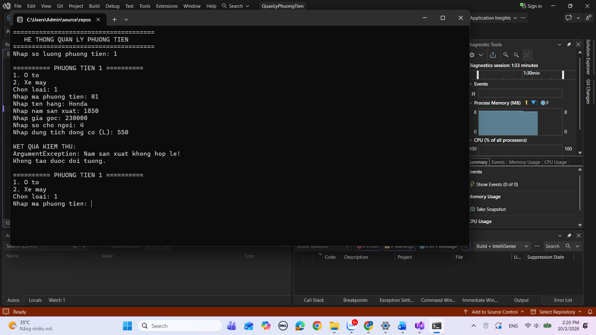
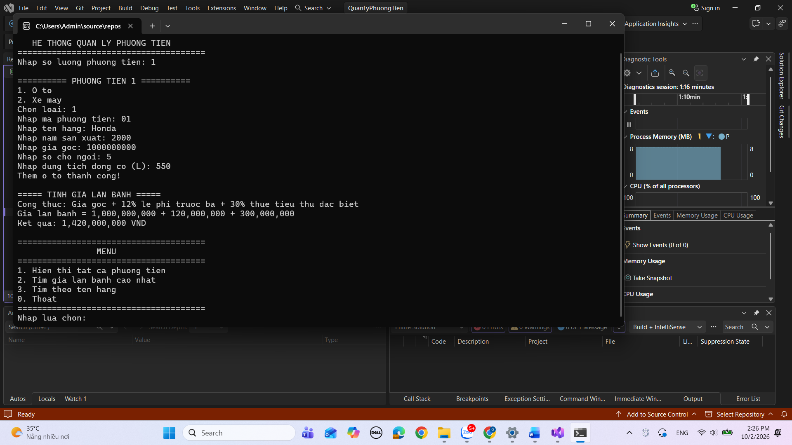
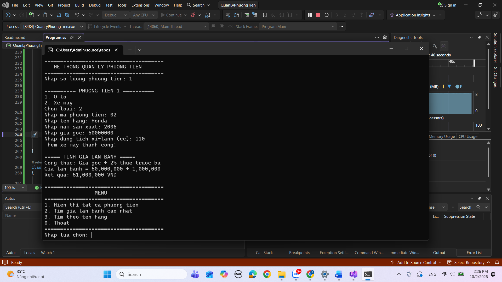
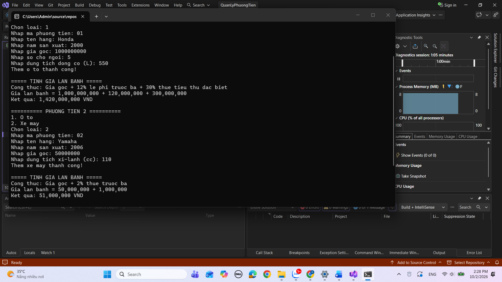

# Bài 02 - OOP

## Ảnh bài làm

### TC01 - Kiểm tra Validation Năm sản xuất

### TC02 - Kiểm tra Tính Giá Lăn Bánh Ô tô

### TC03 - Kiểm tra Tính Giá Lăn Bánh Xe máy

### TC04 - Kiểm tra Đa hình List<PhuongTien>

### TC05 - Kiểm tra Tìm Giá Lăn Bánh Max

